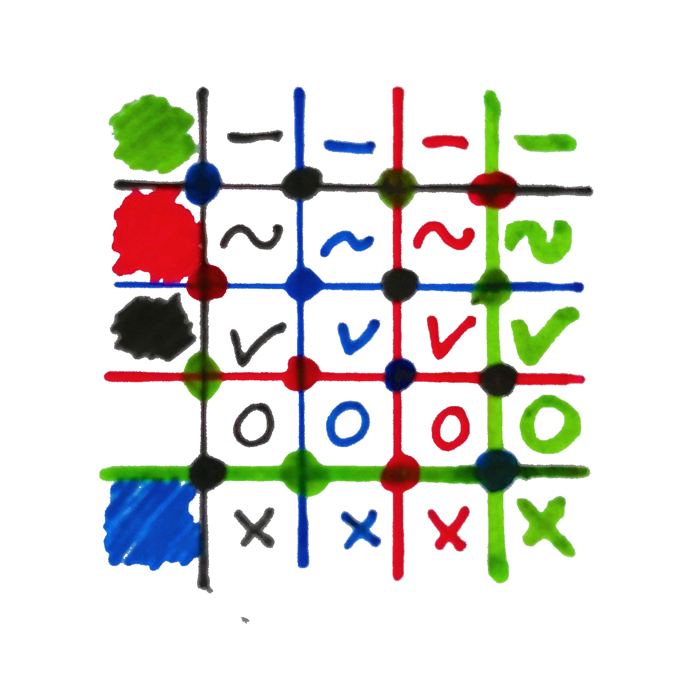
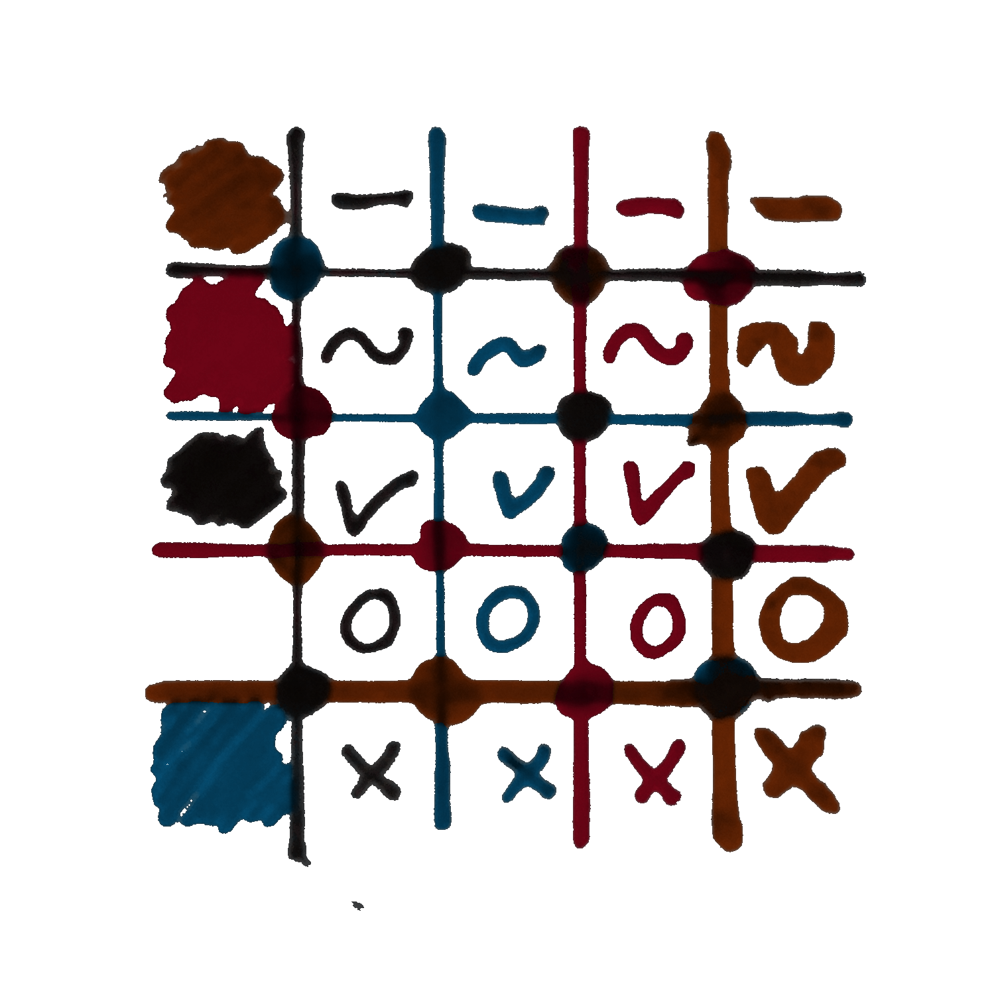
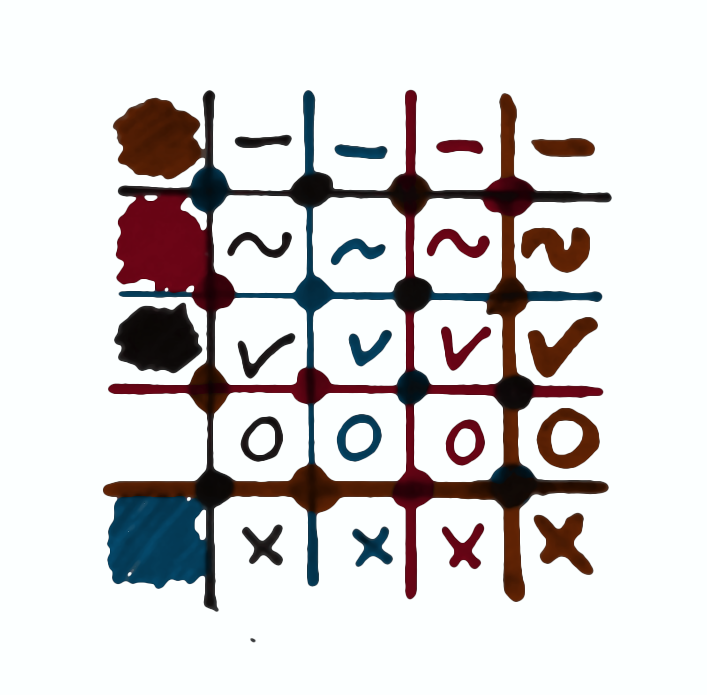

# SketchStyler

Sketch an idea using black, red, green, and blue pens, and then convert its digital scan to match any three color palette. For example,


conversion was made with the command
```console
$ rgb2.py -r (114,0,16) -g (114,41,0) -b (0,73,114) -i original.jpg -o output.png
```
where rgb2.py script was told to
* replace red with dark red (114,0,16)
* replace green with dark orange (114,41,0)
* replace blue with dark cerulean (0,73,114)
* use white as transparent alpha channel.

This way, hand

# Installation

As I haven't tested this thoroughly, it might be a good idea to use a dedicated virtual enviroment first. For example, make a new conda env called rgb:

```console
$ conda create --name rgb
```
activate it
```console
$ conda activate rgb
```

and install pip
```console
$ conda install pip
```

Then clone this repo (to current location)
```console
$ git clone https://github.com/mrbarkis/SketchStyler.git
```

and then install using
```console
$ pip install ./SketchStyler
```
(or run setup.py within SketchStyler folder)

You should now be aple to run the main script

```console
$ rgb2.py -h
```

or to use the modules. For example, install jupyter and run the example notebook, as in

```console
$ conda install jupyter
$ cd SketchStyler
$ jupyter notebook example.ipynb
```


# Tips

1. [Whitelines](https://www.whitelinespaper.com/) paper and its app makes digitizing sketches a breeze. 
2. Gimp's 'Filters -> Blur -> Mean-Curvature-Blur' can work wonders as well. It can smooth both the colors and the edges in a natural-seeming fashion. To use it on the edges, first select 'Layer -> Mask -> Add layer mask -> Transfer layer's alpha channel', and then apply the filter on the layer mask. As an example,


